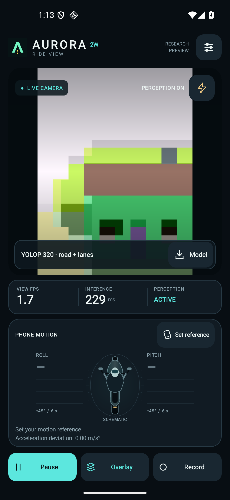
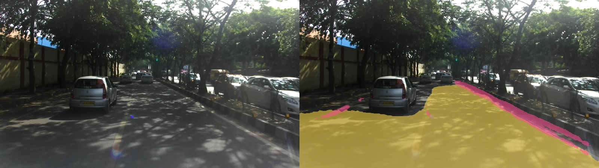
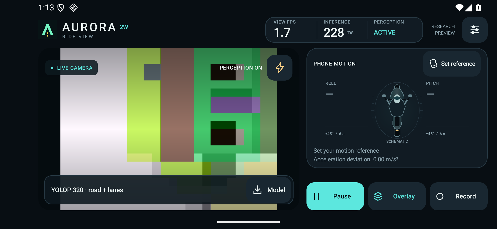

# Aurora 2W
### Road perception for Indian two wheelers

Camera segmentation, phone motion sensing, and an Android research dashboard.

**[Research paper draft](https://docs.google.com/document/d/1gfy6CcsIDq1Y9jjvaacrOeol11MMizD6k33LVqYYGog/edit) · [Build and run](docs/DEVELOPMENT.md) · [Architecture](docs/ARCHITECTURE.md) · [Evidence](docs/EVIDENCE.md)**

Actual app screenshot from the Android emulator. The scene and displayed timing are emulator output, not road accuracy or S21 FE measurements.

## The idea

Indian roads have faded markings, mixed traffic, uneven surfaces and potholes. A phone mounted on a motorcycle adds another challenge: the camera leans and shakes with the rider and the mount.

Aurora 2W combines camera predictions and phone motion in one Android application. We start with a working **YOLOP road and lane baseline**, then investigate whether calibrated inertial guidance can improve perception under motorcycle motion.

## What works today

| Component | Current state |
| :--- | :--- |
| Android dashboard | CameraX preview, portrait and landscape layouts, torch toggle and recording controls |
| Perception | BDD pretrained YOLOP 320 with road and lane outputs |
| Motion display | Relative roll and pitch, graphs and a bike schematic |
| Mobile execution | CPU, XNNPACK and NNAPI selection with numerical checks |
| Indian road data | Prepared baseline: **20,854 training / 3,784 validation records** |
| Aurora research model | MobileNetV3, shared feature pyramid, mask heads and traffic/pothole detector implemented |
| IDFA | Roll guided feature sampling implemented; accuracy benefit awaits controlled training and evaluation |

**The deployed YOLOP package predicts road and lane masks only.** It has not been fine tuned on IDD and does not use IDFA. Vehicle and pothole predictions are not active in this first package.

### A real prediction on an Indian road

Original image on the left; predicted **road in yellow** and **lane pixels in pink** on the right. This is saved desktop inference from BDD pretrained weights, not phone footage. The pink curb is a lane false positive. IDD imagery is credited to the India Driving Dataset authors.

### A dashboard that follows phone motion

Emulator interface screenshot. Camera preview runs independently of segmentation. Old masks are hidden after excessive age or orientation change. A smooth preview does not imply 30 segmentation updates per second.

The bike schematic shows motion relative to the phone's reference pose. It is not a reconstructed traffic scene or a calibrated estimate of the motorcycle's physical lean. Sensors drive the dashboard and overlay freshness checks; they do not enter the current YOLOP network.

## The research architecture

The proposed Aurora network uses MobileNetV3 Large and a compact bidirectional feature pyramid. Independent outputs estimate road and lane masks. An FCOS style detector supports eight traffic classes and potholes.

**IDFA** uses calibrated camera roll and confidence to guide local feature sampling. A bounded learned correction adjusts that geometric starting point. Predictions remain in camera image coordinates.

<strong>How IDFA uses the sensor signal</strong>

Zero confidence returns sampling to the ordinary grid. This does not guarantee identical predictions to a separately trained visual model. IDFA does not remove pitch, yaw, translation, rolling shutter or blur. Its proposed benefit must be tested against equally trained alternatives.

## Measured progress

### Galaxy S21 FE

Saved measurements on **SM-G990B2, Android 16**, using YOLOP 320: median of eight iterations after three warmups, with a fixed 480 × 640 input pattern and compact masks.

| Backend | Prepare | Network | Decode |
| :--- | ---: | ---: | ---: |
| CPU | 34.28 ms | 177.39 ms | 26.23 ms |
| XNNPACK | 35.54 ms | 156.59 ms | 26.63 ms |
| NNAPI | 34.58 ms | 125.47 ms | 29.68 ms |

Camera capture and display are excluded. Stacked bars sum component medians; they are not measured total latency. NNAPI may use CPU fallback. Sustained thermal performance and modest phones remain to be evaluated.

### Software and GPU checks

- Saved Python data and integrity suite: **108 distinct checks passed** on the recorded implementation.
- Saved Android verification: **42 JVM checks and 4 physical Android checks passed**, including backend agreement.
- CUDA integration: **six successful optimizer updates per variant**, with zero overflow skips.
- YOLOP export diagnostic: **eight IDD images**, with exact source/export decision agreement on that subset.

This graph is a short **software integration fixture**, using batch size 2 on an RTX 4050 laptop GPU. It is not a completed research training run, road accuracy or Android FPS. The fixture used real RDD photographs and boxes with artificial test splits. Its loss difference does not establish an IDFA accuracy gain.

[Measurement scope and provenance →](docs/EVIDENCE.md)

## Why IDD matters

| Source | Role | Train | Validation |
| :--- | :--- | ---: | ---: |
| IDD segmentation | Indian road appearance | 4,116 | 540 |
| IDD detection | Indian traffic classes | 4,573 | 1,203 |
| BDD legacy 2018 | Road and painted lane supervision | 6,000 | 500 |
| RDD2022 India | Pothole boxes, class D40 | 6,165 | 1,541 |

The sources label different tasks. Missing labels are ignored rather than treated as background. See [data preparation and attribution](docs/DATA.md).

## Build and explore

Python 3.12, compatible PyTorch/torchvision, JDK 17, Gradle 8.11.1 and Android SDK 35 are needed. Datasets, weights and toolchains are separate from Git.

~~~powershell
git clone https://github.com/alt-Anurag/AuRoRA-2W.git D:\aurora-2w
Set-Location D:\aurora-2w
python -m venv .venv
. .\scripts\env.ps1
python -m pip install -r requirements-lock.txt --extra-index-url https://download.pytorch.org/whl/cu128
python -m aurora2w.cli --help
~~~

Open the android directory in Android Studio, or use scripts/build-android.ps1 after configuring SDK and Gradle. A build without model assets provides the camera and motion interface. Follow [the development guide](docs/DEVELOPMENT.md) to prepare YOLOP and run checks.

## Repository map

~~~text
android/       Kotlin app, resources and Android tests
aurora2w/      Model, IDFA, sensors, data, training and export
configs/       Model presets and source configuration schema
scripts/       Essential build, preparation and validation entry points
tests/         Active Python checks
docs/          Architecture, data, development and evidence
~~~

This revision replaces the earlier working tree. Earlier PIDNet experiments remain in Git history. Datasets, recordings, checkpoints, APKs, reference PDFs, Word drafts, caches and exploratory scripts are excluded.

## Next experiments

1. Evaluate supplied YOLOP weights on a fixed Indian road validation set.
2. Adapt perception to Indian labels and train the planned visual baseline.
3. Compare IDFA against matched visual, augmentation and deformable controls.
4. Validate synchronized rides, night scenes and sustained Android use.
5. Add exact pothole masks when suitable pixel annotations are available.

DrivableNets and HybridNets comparisons will use matched data and metrics. No Aurora accuracy improvement is claimed yet.

## People and references

**Anurag Kumar Jha** · ECE undergraduate, Delhi Technological University 
**Indu Sreedevi** · Department of Electronics and Communication Engineering, Delhi Technological University

[Working research draft](https://docs.google.com/document/d/1gfy6CcsIDq1Y9jjvaacrOeol11MMizD6k33LVqYYGog/edit) · Delhi, India

Built on ideas from DrivableNets, [YOLOP](https://github.com/hustvl/YOLOP), [MobileNetV3](https://arxiv.org/abs/1905.02244), [EfficientDet](https://arxiv.org/abs/1911.09070), [FCOS](https://arxiv.org/abs/1904.01355) and [deformable convolution](https://arxiv.org/abs/1703.06211). Dataset and upstream terms remain applicable.
