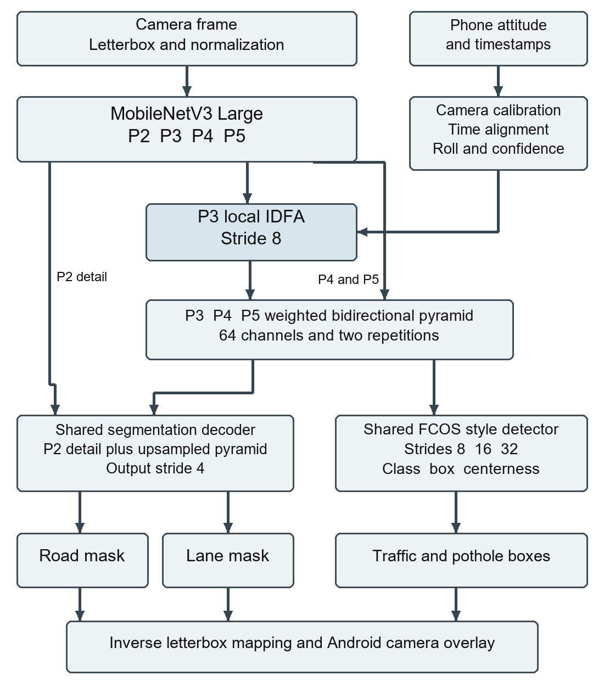
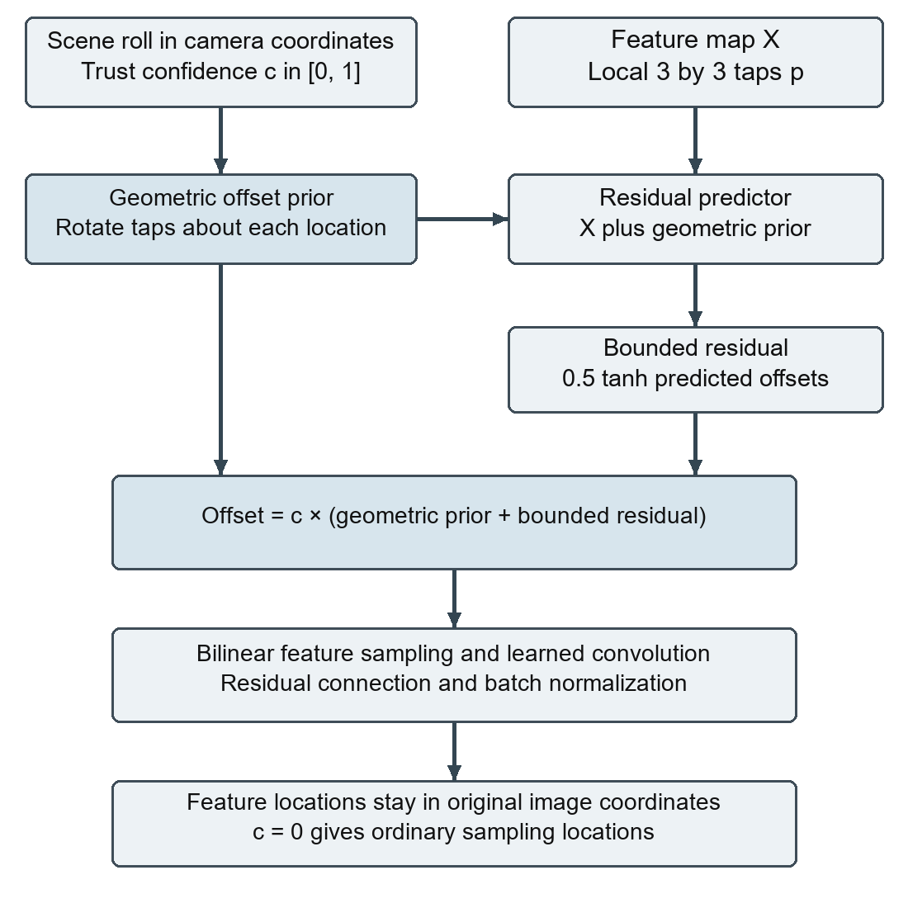

# Architecture

## Working Android baseline
CameraX supplies rear camera images and rotation metadata. YOLOP consumes RGB pixels, resized with padding and normalized. Road and lane margins are mapped back to the camera view. Phone sensors drive the motion display and freshness policy, not YOLOP features. Preview and inference run independently.

## Proposed Aurora network

MobileNetV3 Large extracts P2 to P5. The default input is 384 high by 640 wide with 64 feature channels. IDFA acts at P3 before two bidirectional fusion rounds. P2 preserves detail for two stride 4 mask outputs. The stride 8/16/32 detector supports person, rider, bicycle, motorcycle, autorickshaw, car, bus, truck and pothole.

## IDFA and geometry

IDFA rotates local 3 by 3 sampling taps using calibrated scene roll, adds a learned correction bounded to 0.5 feature pixels per coordinate, and multiplies offsets by confidence. Image x points right, y down; positive roll is clockwise. Implementation offsets use dy then dx.

The inertial model needs camera scene roll, not the dashboard's arbitrary relative angle. Exposure timing, mounting geometry and sensor validity must be checked. Zero confidence disables offsets but not necessarily their runtime cost. The module has implementation checks; accuracy remains unmeasured.

[Annotation contract](PHASE2_DATA.md) · [Model interface](MODEL_CONTRACT.md)
