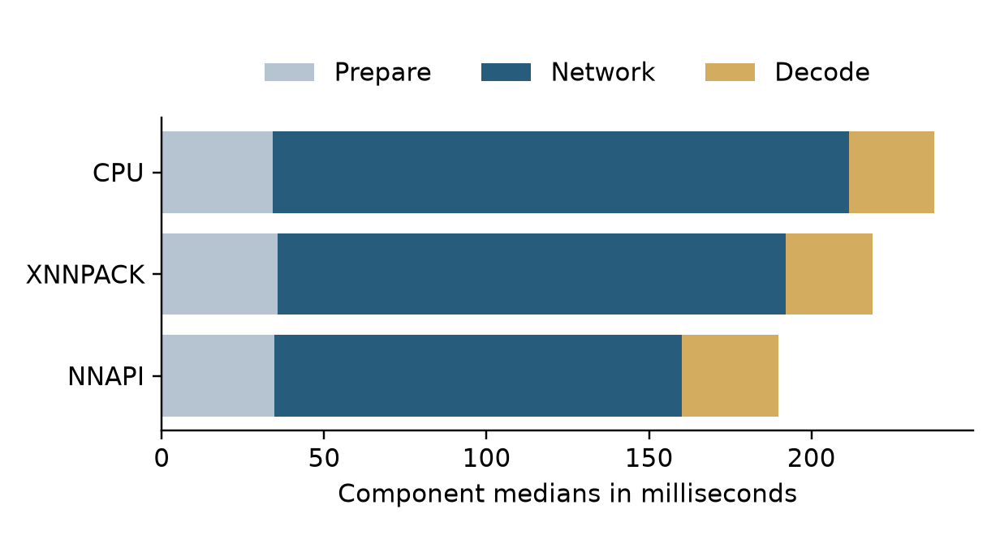
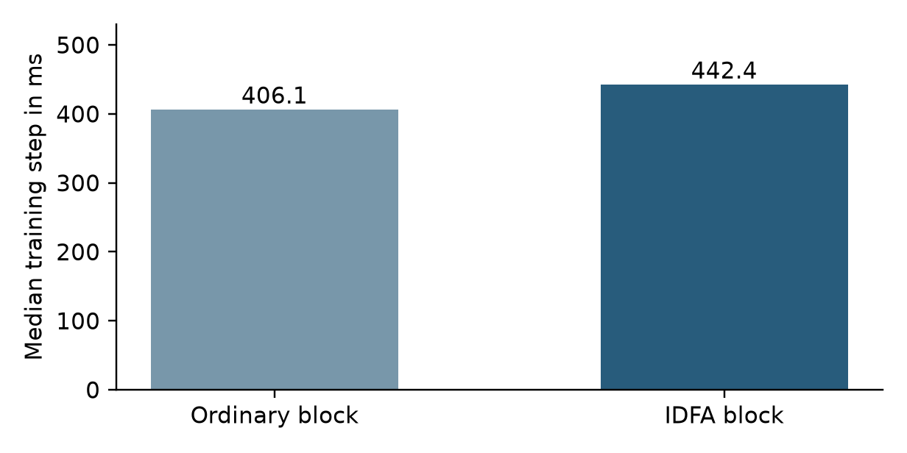

# Evidence and interpretation

These are saved September 2026 implementation measurements, not a new accuracy experiment.

| Evidence | Original local record | Meaning |
| --- | --- | --- |
| S21 FE timings, 42 JVM and 4 Android checks | artifacts/smooth-motion/verification.json | Short runtime and numerical checks |
| Data counts and 108 Python checks | artifacts/implementation-verification.json | Recorded software and dataset verification |
| Six CUDA updates per variant | artifacts/gpu-integration.json | Artificial integration split with real RDD images |
| Eight IDD previews | artifacts/yolop-idd-preview-320/report.json | Supplied YOLOP weights and export agreement |

Relevant runtime values are preserved in [evidence.json](evidence.json). Historical counts do not imply every old test is retained or rerun in this curated tree.

## Phone
The final S21 FE run used a 480 by 640 pattern, a 320 square network, three warmups and eight measured iterations. Capture and UI are excluded. The recorded interactive UI session still had 16.96 percent janky frames. Sustained and low cost phone results remain unmeasured.

## CUDA fixture
Six updates per variant completed without overflow skips. Final losses were 3.7084 and 3.5030. The fixture used 24 images with an artificial 20/4 split and no trusted IMU. This loss difference is not evidence of an IDFA benefit.

The graph profiles random model optimizer steps on an RTX 4050, batch size 2, mixed precision and 384 by 640 input, with the first warmup excluded. It is not complete research training time or Android FPS.

## Pending
Aurora road/lane accuracy, traffic/pothole AP, IDFA ablations, independent rides, night robustness and sustained modest phone execution. Reference paper scores are not Aurora results.

## Publication checks
The curated source was checked on 14 September 2026. The initial Python run passed 152 tests; two missing test fixtures were restored, and the affected four tests then passed, covering all 154 collected tests. Android assembleDebug, 42 JVM tests and lintDebug completed successfully. These checks verify software behavior, not trained road accuracy. The physical phone checks above are historical measurements.

